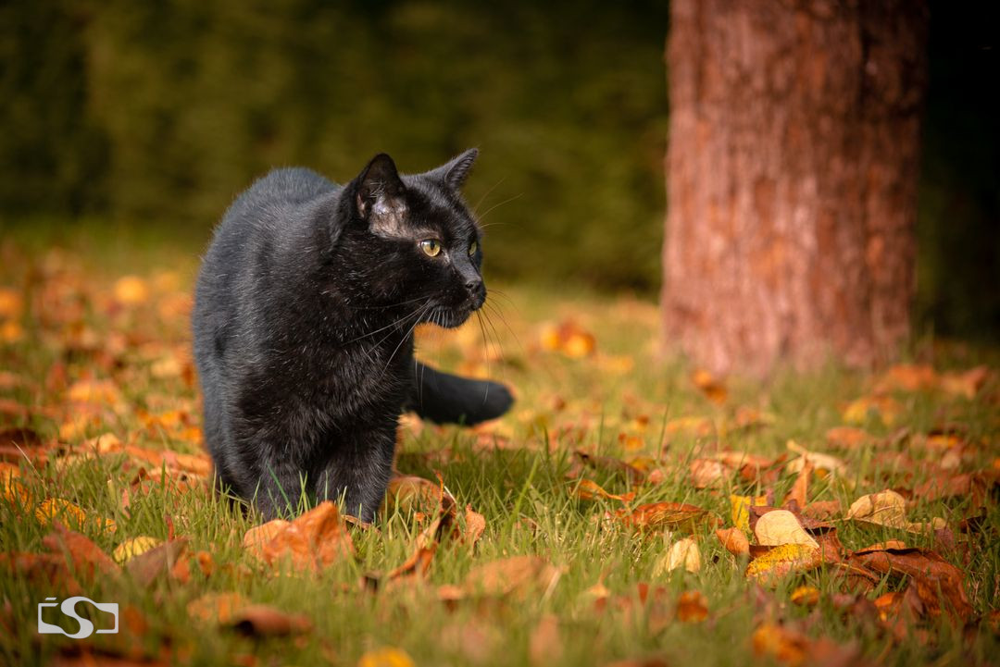

# 🐱 RONKY 🐱

[](https://crates.io/crates/ronky)
[](https://github.com/modiimedia/arri)
[](https://github.com/modiimedia/arri)
[](https://github.com/modiimedia/arri)

_"Converting Rust types shouldn't be this purr-fect, but here we are..."_

## 😺 What in the Whiskers is Ronky?

Imagine if your Rust types could speak other languages without learning a single foreign word.
That's Ronky – your code's personal polyglot translator that speaks fluent
[Arri](https://github.com/modiimedia/arri), turning your carefully crafted Rust types into
schemas that even JavaScript developers can understand.

Born from the frustration of manual schema creation (and named after a particularly vocal cat),
Ronky does the tedious work so you can focus on the important stuff – like deciding whether your
next variable should be called `data` or `info` (we both know you'll pick `data`).


<!--toc:start-->

- [🐱 RONKY 🐱](#-ronky-)
  - [😺 What in the Whiskers is Ronky?](#-what-in-the-whiskers-is-ronky)
  - [✨ Features That Make You Go "Meow!"](#-features-that-make-you-go-meow)
  - [🤝 The Cool Cats Club (Compatible Crates)](#-the-cool-cats-club-compatible-crates)
  - [📚 The Illustrated Guide to Ronky](#-the-illustrated-guide-to-ronky)
    - [🔄 The Basic Transformation](#-the-basic-transformation)
    - [🧩 The Advanced Cat-egory: Building Complex Types](#-the-advanced-cat-egory-building-complex-types)
  - [📋 Quick Reference](#-quick-reference)
    - [The Basics](#the-basics)
    - [Attribute Options](#attribute-options)
  - [🐈 The Ronky Memorial Section](#-the-ronky-memorial-section)
  - [🛠️ Development](#️-development)
    - [Pre-commit Hooks](#pre-commit-hooks)
    - [Running Tests](#running-tests)
    - [Code Quality Checks](#code-quality-checks)
  - [🌟 Final Thought](#-final-thought)
  <!--toc:end-->

## ✨ Features That Make You Go "Meow!"

Ronky doesn't just toss your types over the fence to Arri-land. It crafts them with the same
attention to detail that a cat gives to knocking your most precious possessions off shelves:

```text
┌───────────────────────────────────────────────────────────────────────┐
│                          RONKY'S REPERTOIRE                           │
├───────────────────────────┬───────────────────────────────────────────┤
│ 🧬 Type Wizardry          │ - Transforms primitives with grace        │
│                           │ - Handles generic types without whining   │
│                           │ - Makes associated types feel welcome     │
├───────────────────────────┼───────────────────────────────────────────┤
│ 🧩 Collection Conjuring   │ - Vectors become elegant "elements"       │
│                           │ - Maps manifest as "values" schemas       │
│                           │ - Optional types know when to disappear   │
├───────────────────────────┼───────────────────────────────────────────┤
│ 🛡️ Guardian Features      │ - Strict mode keeps schemas pristine      │
│                           │ - Discriminators tag unions properly      │
│                           │ - Circular refs handled without dizziness │
├───────────────────────────┼───────────────────────────────────────────┤
│ 🔄 Transformation Magic   │ - Case transformations (snake → UPPER)    │
│                           │ - Field renaming for multilingual joy     │
│                           │ - Nullable marking for optional presence  │
├───────────────────────────┼───────────────────────────────────────────┤
│ 📝 Documentation Delight  │ - Comments become documentation           │
│                           │ - Deprecation warnings that don't nag     │
│                           │ - Metadata that brings joy to readers     │
└───────────────────────────┴───────────────────────────────────────────┘
```

With Ronky, your type schema generation is both:

1. **Compile-time verified** - Errors at compile time, not at 3 AM when you're deploying
2. **Automatically generated** - Because life's too short to manually update schemas

> 💡 **Pro Tip**: Ronky's powers grow with your documentation. The more doc comments you add,
> the more magnificent your schemas become. It's like feeding treats to a cat – the rewards
> are well worth it.

## 🤝 The Cool Cats Club (Compatible Crates)

Ronky has an extensive social network. Think of these crates as the neighborhood cats that
regularly visit your backyard – they're all welcome and get special treatment:

```text
TEMPORAL FRIENDS         🕰️  chrono, time
IDENTITY SPECIALISTS     🪪  uuid
BIG NUMBER EXPERTS       🔢  bigdecimal, num-bigint, num-bigfloat
PRECISION MASTERS        💰  rust_decimal, decimal
WEB-SAVVY NAVIGATORS     🌐  url
DATA-HANDLING WIZARDS    📊  bytes
CONCURRENT COMPANIONS    🧵  dashmap
OPTIMIZED PERFORMERS     ⚡  smallvec
```

Each of these crates gets the VIP (Very Important Purring) treatment from Ronky. Their types
are handled with the care and respect they deserve.

> 🐈 **Missing your favorite companion?** Check if an issue exists, and if not, create one!
> The more the merrier in Ronky's compatible crates collection.

## 📚 The Illustrated Guide to Ronky

### 🔄 The Basic Transformation

```rust
use ronky::{Exportable, Exported, SCHEMA_VERSION};
use serde_json::{Value, from_str, to_string_pretty};

// Just add water (and a derive macro)
#[derive(Exported)]
#[arri(transform = "uppercase")] // LOUD NOISES
enum Result<T: Exportable, E: Exportable> {
    /// When things go right (rarely, if you're me)
    Ok(T),
    /// When things go wrong (my default state)
    Err(E),
}

fn main() {
    // Announce our intentions to the world
    println!("🧪 Creating an Arri {} schema and hoping for the best...", SCHEMA_VERSION);

    // The cat-alchemy happens here
    let schema_json = Result::<String, ()>::export()
        .serialize()
        .expect("this to work (please, I have deadlines)");

    // Humans like pretty things
    let pretty_json = to_string_pretty(&from_str::<Value>(&schema_json).unwrap()).unwrap();

    // Admire our handiwork
    println!("{}", pretty_json);

    // Now go make a cup of tea, you've earned it
}
```

### 🧩 The Advanced Cat-egory: Building Complex Types

```rust
use ronky::{Exportable, Exported, SCHEMA_VERSION};

/// Metadata about things (and sometimes other things)
/// Automatically converts snake_case field names to camelCase for the schema
#[derive(Exported)]
#[arri(rename_all = "camelCase")] // firstName, lastName, etc. in the schema
struct About<T: Exportable> {
    /// What we called it before marketing got involved
    #[deprecated(since = "1.0.0", note = "Use `firstName` and `lastName` instead")]
    name: String,

    /// The name that appears on your coffee cup at Starbucks
    first_name: String, // Becomes "firstName" in the schema

    /// The name your parents use when you're in trouble
    last_name: Option<String>, // Becomes "lastName" in the schema

    /// The number that makes you sigh at birthday parties
    age: u32,

    /// The subject of our obsession
    of: T,
}

/// A creature that creates Rust crates, ironically
#[derive(Exported)]
#[arri(strict)] // No surprises allowed! Like a cat with a cucumber
struct Human {
    /// Fellow code-monkeys who review your PRs
    friends: Vec<Human>, // Recursive types? No problem!

    /// The real owners of your home
    pets: Vec<About<Pet>>,
}

/// Fashion choices for the discerning feline
#[derive(Exported)]
#[arri(transform = ["snake_case", "uppercase"])] // MULTI_STYLE_TRANSFORMATION
enum CatColor {
    /// Like my coffee and my humor
    Black,

    /// Like my documentation standards and error handling
    White,

    /// Like my moral compass when it comes to optimization
    Gray,

    /// Like my commit history after a weekend hackathon
    MixedGrayWhite,
}

/// Entities that interrupt your Zoom calls at the worst possible moment
#[derive(Exported)]
#[arri(transform = "uppercase", discriminator = "species")]
enum Pet {
    Dog {
        /// The word you'll repeat 37 times at the dog park
        name: String,

        /// What you'll forget when the vet asks
        #[arri(nullable)]
        breed: Option<String>,
    },

    #[arri(rename = "cat")] // All hail the cat overlords!
    Lion {
        /// A suggestion they might consider responding to someday
        name: String,

        /// Their royal garment
        #[arri(nullable)]
        color: Option<CatColor>,
    },
}
```

> 🔥 **Hot Tip**: These examples aren't just decorative – they're functional!
> Copy, paste, and experience the magic of Ronky firsthand. Your future self
> will thank you when your API documentation is automatically up-to-date.

## 📋 Quick Reference

### The Basics

1. Add `ronky` to your `Cargo.toml`:

   ```toml
   [dependencies]
   ronky = "1.0.0"  # Check crates.io for the latest version
   ```

2. Import the essentials:

   ```rust
   use ronky::{Exported, SCHEMA_VERSION};
   ```

3. Decorate your types:

   ```rust
   #[derive(Exported)]
   struct MyType { /* fields */ }
   ```

4. Export and serialize:

   ```rust
   let schema = MyType::export().serialize().unwrap();
   ```

5. Profit! (This step is not automated by Ronky, sorry)

### Attribute Options

**Struct-level attributes:**
- `#[arri(strict)]` - No extra properties allowed
- `#[arri(rename_all = "camelCase")]` - Transform all field names to a specific case
  - Supported cases: `camelCase`, `PascalCase`, `snake_case`, `SCREAMING_SNAKE_CASE`, `kebab-case`, `SCREAMING-KEBAB-CASE`
- `#[arri(transform = "snake_case")]` - Transform enum variant names (enums only)
- `#[arri(discriminator = "type")]` - Set discriminator field name (tagged unions only)

**Field-level attributes:**
- `#[arri(rename = "newName")]` - Rename a specific field or variant (overrides `rename_all`)
- `#[arri(nullable)]` - Mark a field as nullable

## 🐈 The Ronky Memorial Section

```text
     /\_/\
    ( o.o )
     > ^ <
    /  O  \  "Meow meow, transform types meow."
                                    - Ronky (2010-2024)
```

This library immortalizes a magnificent cat named Ronky, named for his thunderous purrs
(or "ronks" in Dutch). For 14 remarkable years, this whiskered genius supervised
everything that happened in the house.

Despite battling acromegaly, Ronky maintained a proud dignity and an uncanny ability
to walk across keyboards and make his presence known. His legacy continues in this library!

He passed away peacefully, surrounded by those who loved him, and will be deeply missed.


Photo by [Startshot](https://www.instagram.com/_startshot_/)

## 🛠️ Development

### Pre-commit Hooks

This project uses pre-commit hooks to maintain code quality. We support both `pre-commit` and `prek` (a Rust implementation that uses the same `.pre-commit-config.yaml` format).

**Auto-fixing**: The hooks automatically fix formatting issues, clippy warnings, trailing whitespace, and line endings. See [docs/AUTO_FIXING.md](docs/AUTO_FIXING.md) for details.

#### Using prek (Recommended for Rust projects)

`prek` is a Rust-based pre-commit hook runner that uses the standard `.pre-commit-config.yaml` configuration file.

```bash
# Install prek (if not already installed)
cargo install prek

# Install hooks
prek install

# Run all hooks manually
prek run --all-files

# Run specific hook
prek run cargo-fmt
```

#### Using pre-commit

```bash
# Install pre-commit
pip install pre-commit

# Install hooks
pre-commit install

# Run all hooks manually
pre-commit run --all-files
```

### Running Tests

```bash
# Run all tests with nextest
cargo nextest run --all

# Run specific test
cargo nextest run serialization_export

# Run with standard cargo test
cargo test --all
```

### Code Quality Checks

```bash
# Format code
cargo fmt --all

# Run clippy
cargo clippy --all-features --all-targets -- -D warnings

# Check compilation
cargo check --all --all-features

# Run all checks at once
./scripts/pre-commit-all.sh
```

## 🌟 Final Thought

Remember: Type conversion should be like a cat's nap – automatic, elegant, and requiring
no effort on your part. Let Ronky handle the tedious work while you focus on building
something amazing.

Now go pet your cat (or dog, or rubber duck) – they've been waiting patiently while you
read this documentation. ❤️
